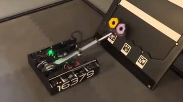

.. include:: <isonum.txt>

Custom Options
==============

Some teams have opted to build custom solutions for linear motion. Many of these teams borrow concepts from FRC\ |reg| teams, modeling their elevators off of the tall systems found on the larger robots. There's a reason that many competitive FRC teams build the same type of elevator - at their scale, the box tube elevator has proven to be the most efficient way to get game pieces off the ground at blisteringly fast speeds.

When built correctly, an elevator of this type can withstand hundreds of pounds of load on any axis while barely weighing anything. However, existing off-the-shelf options already fill the linear motion needs of most FTC\ |reg| teams.

Custom extension systems also require tons of work in CAD, hours upon hours of manufacturing time, and may need multiple iterations before they work correctly. Due to their complexity and how challenging they are to design, less experienced teams may encounter significant challenges.

.. note:: Lightweight drawer slides (MiSUMI aluminum and Long Robotics Slides) can offer similar performance without sifnificantly increasing complexity.

   16379 KookyBotz, Centerstage, custom box tube linear elevator
   
.. image:: images/custom/16460-MGN-rail.png
   :alt: 16460 GEarheads, Into The Deep, custom MGN rail linear elevator

    16460 GEarheads, Into The Deep, custom MGN rail linear elevator

   .. figure:: images/custom/5975-carbon-fiber.png
   :alt: 5975 CYBOTS?, Relic Recovery, custom carbon fiber rod linear elevator

   5975 CYBOTS?, Relic Recovery, custom carbon fiber rod linear elevator

